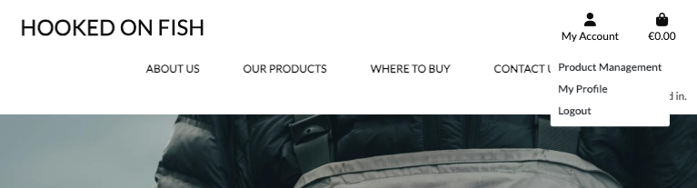
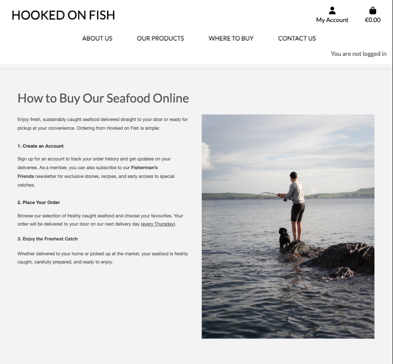

# HOOKED ON FISH


[View Live Website here.](https://hooked-on-fish-85d55f56e378.herokuapp.com/)

[GitHub Repo](https://github.com/LemmenAid/hooked-on-fish)

***

## Index – Table of Contents
* [Features](#features)
* [Project Development](#project-development)
* [Layout](#layout)
* [Data Schema](#data-schema)
* [Design](#design)
* [Technologies Used](#technologies-used)
* [Testing](#testing)
* [Deployment](#deployment)
* [Credits](#credits)

***

### Project Description  

_Hooked on Fish is a website for my final portfolio project with [Code Institute](https://codeinstitute.net/ie/)._

Hooked on Fish is a website for a small-scale, sustainable seafood business based in Connemara, Galway, Ireland. The business is run by a local fisherman who catches fresh seafood daily—including mackerel, brown crab, lobster, scallops, and shrimp. 

The website allows customers in the Connemara area to order fresh seafood online and have it delivered to their doorstep. It features a fully functional shopping bag and checkout system, integrated with Stripe for secure payments.

Registered users can access their profile page, where they can view their order history and save delivery information for a smoother checkout experience. In addition to e-commerce functionality, the site serves as an online presence for the business, providing updates on the latest catch, product availability, and market locations.

### Project Purpose

The purpose of Hooked on Fish is to create a digital storefront that reflects the business’s values—sustainability, transparency, and quality. The website connects local customers with fresh seafood while offering an inside look at the fishing process through a newsletter called Fisherman’s Friends. It also serves as a foundation for expanding the business’s reach through local markets and direct sales.

***

## Features

### General Features on each page

#### Navigation Bar

* Displayed across all pages, the navigation bar provides links to Home, About, Products, Contact, and an Instagram page for social updates.


Navigation bar:<br>


Navigation bar for members:<br>


Dropdown navigation menu:<br>


***

#### The Footer

The footer appears on every page and includes the business logo, copyright information, and links to the business’s social media accounts. 
It's also possible to Sign Up for the FIsherman's Friends newsletter in the footer.


***

### Features by page

#### Home Page
The homepage introduces Hooked on Fish with a striking hero image and a clear call-to-action, encouraging visitors to learn more about the business and its products.


***

#### About Us Page
The About page tells the story of Hooked on Fish, focusing on Thomas's experience as a fisherman, the boat Fortibus, and the business’s commitment to sustainable fishing practices.


***

#### Products Page
This page showcases the available seafood, providing descriptions and sustainability notes for each type of catch. The page is designed for easy future expansion into an e-commerce platform.


***

#### Profile
The personalized profile page gives logged-in members a clear overview of their past orders. It also allows them to save and update their delivery information for a smoother checkout experience.


***

#### Where to buy Pages
On these pages, visitors can read information on where and how to buy the Hooked on Fish products.




***

#### CRUD for SuperUser
A superuser has full CRUD functionality to manage the products on the website.
<br>
For users who are not logged in, the Edit and Delete product options are not accessible.
<hr>

#### Products when logged in as a super user:


#### Product Management page for a super user:


***

#### Contact Page
A contact form allows customers to reach out with inquiries, whether they’re looking for specific seafood, bulk orders, or general information. The form includes a dropdown menu for users to select their inquiry type.


***

#### Sign-Up Page
A page where users can register for an account on the Hooked on Fish website.


***

#### Custom Error Handler Page
Custom error pages to ensure user-friendly navigation, even in unexpected situations.


***

### Future Implementations

* A weekly catch update displaying available seafood in real-time.
* A recipe section featuring simple seafood recipes using the business’s  fresh products.
* A fishing report archive, giving insight into seasonal trends and sustainable practices.
* A gallery page of all images features on the website.

***

## Project Development

### Creating Process

Developing Hooked on Fish has been an exciting challenge, combining both backend and frontend skills. Since this project is a real-world business application, my goal was to create a professional, minimal, and user-friendly website that accurately represents the brand.

This project allowed me to further develop my knowledge of Django, Bootstrap, and database management. I focused on clean code, easy navigation, and practical business functionality. The process involved careful planning to ensure the website could scale in the future if the business expands.

### Project SetUp

The project follows an MVC framework using Django. The foundational pages were built first (Home, About, Products, and Contact), followed by dynamic elements like the where to buy and contact form.

I also incorporated user stories and an agile approach to ensure a structured development process.

Jump to Credits: [Credits](#credits)

***

### Agile Development

[GitHub Projects](https://github.com/users/LemmenAid/projects/5/views/1) served as an Agile tool for the development of this project. 

I started with creating the User Stories. Then these stories were broken down into tasks as steps to follow in the building process of the website. I added these steps to the Project Board on Github to keep track of the buidling process and to assist with better organisation and prioritisation of the tasks. I made sure that Should-have prioritised user stories were not more than 60% of the timebox user story points total.


<details>
<summary> User Story Template
</summary>


</details>

<details>
<summary> User Story Issues
</summary>


</details>

<details>
<summary> Project Board
</summary>


</details>
<br>

***

### User Stories

VISITOR

1. As a visitor, I want to easily understand the purpose of the website, so I can decide if I want to explore further.
2. As a visitor, I want to see a clear and engaging homepage, so I feel drawn into the brand.
3. As a visitor, I want to browse the available seafood products, so I can see what’s on offer.
4. As a visitor, I want to know where the seafood is sourced from, so I can trust the authenticity of the product.
5. As a visitor, I want to find contact details, so I can get in touch with the business for any questions.

CUSTOMER

6. As a customer, I want to create an account, so I can save my details for future orders.
7. As a customer, I want to easily add products to a cart, so I can purchase multiple items in one order.
8. As a customer, I want to securely pay for my order online, so I can confidently complete my purchase.
9. As a customer, I want to receive an order confirmation email, so I know my purchase has been successful.
10. As a customer, I want to leave a review for the products I purchased, so I can share my experience.

ADMIN

11. As an admin, I want to add, edit, or remove seafood products, so the inventory stays up to date.
12. As an admin, I want to manage customer orders, so I can ensure they are processed and delivered correctly.

MARKETING

13. As a visitor, I want to subscribe to a newsletter, so I can stay updated on news and special offers.
14. As a visitor, I want to follow the business on social media, so I can see updates and connect with the brand.
15. As a visitor, I want to view recipes or cooking tips for seafood, so I can feel inspired to try new dishes.


***

## Layout

### Wireframes

The layout is clean and minimal. Navigation is streamlined through a clear menu bar, with links to key areas such as Products, Contact, and About.

Key interface elements include:

- Interactive buttons for saving and deleting products, visible only when applicable.
- Clear error pages that redirect users when something goes wrong.
- Responsiveness is a priority, ensuring smooth usability on mobile and desktop devices.

Wireframes were created using Balsamiq to plan the site’s structure.

<details>
<summary> Home Page
</summary>


</details>

<details>
<summary> Text Pages
</summary>


</details>

<details>
<summary> Products Page
</summary>


</details>

<details>
<summary> Mobile View
</summary>


</details>
<br>

***

### Data Schema

The database structure follows a relational model with key entities for products, buy, and contact inquiries. Below is an Entity Relationship Diagram that shows the key models and their fields:

<details>
<summary> Entity Relationship Diagram (ERD)
</summary>


</details>
<br>


#### 1. About Model

Attributes:
- title (CharField)
- profile_image (CloudinaryField)
- content (TextField)
- updated_on (DateTimeField)

Purpose:
Represents content for the "About Us" page, storing text, images, and last update information.

#### 2. Grounds Model

Attributes:
- title (CharField)
- profile_image (CloudinaryField)
- content (TextField)
- updated_on (DateTimeField)

Purpose:
Stores details about the "Our Fishing Grounds" page, displaying information about the fishing locations.

#### 3. BuyOnline Model

Attributes:
- title (CharField)
- profile_image (CloudinaryField)
- content (TextField)
- updated_on (DateTimeField)

Purpose:
Holds details displayed on the "Buy Online" page, including images, descriptions, and updates.

#### 4. BuyInPerson Model

Attributes:
- title (CharField)
- profile_image (CloudinaryField)
- content (TextField)
- updated_on (DateTimeField)

Purpose:
Contains details for the "Buy in Person" page, listing locations where customers can purchase seafood.

Relationships Overview:

- One-to-Many: Related to the PartnerShop model.

#### 5. PartnerShop Model

Attributes:
- name (CharField)
- address (TextField)
- website (URLField)
- buy_in_person (ForeignKey → BuyInPerson)

Purpose:
Stores details of partner shops selling Hooked on Fish products, linking them to the BuyInPerson model.

Relationships Overview:

- Many-to-One: Linked to BuyInPerson (a shop belongs to a location where customers can buy seafood).

#### 6. Order Model

Attributes:
- order_number (CharField)
- user_profile (ForeignKey → UserProfile)
- full_name (CharField)
- email (EmailField)
- phone_number (CharField)
- country (CountryField)
- postcode (CharField)
- town_or_city (CharField)
- street_address1 (CharField)
- street_address2 (CharField)
- county (CharField)
- date (DateTimeField)
- delivery_cost (DecimalField)
- order_total (DecimalField)
- grand_total (DecimalField)
- original_bag (TextField)
- stripe_pid (CharField)

Purpose:
Represents an order placed by a customer, storing details about their purchase, delivery, and payment.

Relationships Overview:

- One-to-Many: Related to the OrderLineItem model (each order has multiple items).
- Many-to-One: Related to UserProfile (a user can have multiple orders).

#### 7. OrderLineItem Model

Attributes:
- order (ForeignKey → Order)
- product (ForeignKey → Product)
- quantity (IntegerField)
- lineitem_total (DecimalField)

Purpose:
Stores individual products within an order, tracking quantities and prices.

Relationships Overview:

- Many-to-One: Linked to Order (each order has multiple line items).
- Many-to-One: Linked to Product (each line item corresponds to a product).

#### 8. Contact Model

Attributes:
- name (CharField)
- email (EmailField)
- topic_choices (CharField with predefined choices)
- referral_source (CharField with predefined choices)
- message (TextField)
- read (BooleanField)

Purpose:
Captures inquiries submitted via the contact form, including user details and the topic of their message.

#### 9. Product Model

Attributes:
- sku (CharField)
- name (CharField)
- description (TextField)
- caught_in_these_waters (CharField)
- price (DecimalField)
- image_url (CloudinaryField)
- image (ImageField)

Purpose:
Represents products available for sale on the website, including seafood items and their details.

Relationships Overview:

- One-to-Many: Related to the OrderLineItem model (products are included in multiple orders).

#### 10. UserProfile Model

Attributes:
- user (OneToOneField → User)
- default_phone_number (CharField)
- default_street_address1 (CharField)
- default_street_address2 (CharField)
- default_town_or_city (CharField)
- default_county (CharField)
- default_postcode (CharField)
- default_country (CountryField)

Purpose:
Stores default delivery details and order history for registered users, enhancing their shopping experience.

Relationships Overview:

- One-to-One: Extends the built-in User model.
- One-to-Many: Related to Order (users can have multiple orders).

<br>

This schema efficiently organizes data to support Hooked on Fish' functionality, such as customer profiles, products and contact forms. It leverages Django's ORM to enforce relationships and constraints.

***

## Design

### Colour Scheme


The color scheme is intentionally simple and clean. To maintain a clear and uncluttered design, I’ve used only a few shades of green-blue to add subtle color while keeping the reader’s focus on the content.

For the background, I chose a neutral white, complemented by deep charcoal for headers and accents. This contrast ensures readability and accessibility without overpowering the page.

### Typography

The typography on Hooked on Fish features a clean, sans-serif font (Lato) to ensure a crisp, modern, and easily readable design. 

The following code has been imported into the top of the base.html file:

     <link rel="stylesheet" href="https://fonts.googleapis.com/css?family=Lato&display=swap">

Lato:<br>
<br>


### Imagery

Several image sources were used for the images throughout the website.<br>
All other photo's on the website are taken by me.
<br>

<details>
<summary> The links to the sourced images are listed here:
</summary>

* [Home Page Image, Photo by Gaspar Zaldo from Pexels](https://www.pexels.com/photo/person-picking-spinners-in-a-small-container-6739268/)

* [Kona-Mara Product Image, Photo by Kindel Media from Pexels](https://www.pexels.com/photo/silver-fish-in-white-plastic-container-8352392/)

* [Crab Product Image, Photo by Kindel Media from Pexels](https://www.pexels.com/photo/person-holding-brown-crab-8351592/)

* [Scallop Product Image, from Fishi Seafood](https://fishi.com.au/product/scallop/)

* [Cod Product Image, from Marinel Seafood](https://marinel.com/en/saithe-pollock/)


</details>

*** 

## Technologies Used

### Languages

* HTML
* CSS
* Javascript
* Python

### Frameworks, programs and libraries

* [Django](https://docs.djangoproject.com/en/5.0/) - Framework used to create website.
* [AllAuth](https://docs.allauth.org/en/latest/) - used to provide authentication framework for the project.
* [Django signals](https://docs.djangoproject.com/en/5.0/topics/signals/) - Using signals.py to automatically create a profile when a new member registers.
* [PostGreSQL database](https://www.postgresql.org/) - used as the relational database management for the website.
* [Github](https://github.com/) - Used for hosting the repository.
* [VS Code](https://code.visualstudio.com/) - Used for developing the application.
* [Am I Responsive?](https://ui.dev/amiresponsive) - Used to create an image of the website on various screen sizes.
* [Heroku](https://www.heroku.com/) - Used for deploying the live project.
* [Bootstrap](https://getbootstrap.com/) - Used to add style to the displayed pages
* [ChatGPT](https://chat.openai.com/) - Used to create the content for about page and where to buy pages.
* [Code Beautify](https://codebeautify.org/) - Used to format HTML and CSS code.
* [Clouidnary](https://cloudinary.com/) - Used to host images and integrate with django and the admin portal.

### Design
* Fonts from [Google Fonts](https://fonts.google.com/) 
* Favicon [Favicon](https://favicon.io)
* Wireframes [Balsamiq wireframe](https://balsamiq.com/)
* Images from several sources, underwhich [Pexels](https://www.pexels.com/)
* Colour palette generator [Coolors](https://coolors.co/)

***

## Testing

For all testing, please refer to the [TESTING.md](TESTING.md) file.

***

## Deployment 
_I have used several different READMEs to write the deployment section of this README.<br> 
All listed in the credit section below._<br>


The Live deployed application can be found deployed on [Heroku](https://hooked-on-fish-85d55f56e378.herokuapp.com/).<br>
This project was developed using [Visual Studio Code](https://code.visualstudio.com/) and committed to git and pushed to GitHub.

### Database
This project uses [Neon.tech](https://www.neon.tech) for the PostgreSQL Database. This was provided by Code Institute via a database-maker website for Code Institute Students.

### Cloudinary API

This project uses the Cloudinary API to store media assets online, due to the fact that Heroku doesn't persist this type of data.

To obtain your own Cloudinary API key, create an account and log in.<br>
On your Cloudinary Dashboard, you can copy your API Environment Variable.<br>
Be sure to remove the CLOUDINARY_URL= as part of the API value; this is the key.

### Heroku Deployment 

The application was deployed to Heroku. In order to deploy, the following steps were taken:

1. If you have an account, login to Heroku. Otherwise create a new account.
2. Once signed in, click the "New" button in the top right corner, below the header and choose "Create new app".
3. Choose a unique name for the application and select your region. When done, click "Create app".
4. This brings you to the "Deploy" tab. From here, click the "Settings" tab and scroll down to the "Config Vars" section and click on "Reveal Config Vars" and set your environment variables.

| Key | Value |
| --- | --- |
| `CLOUDINARY_URL` | user's own value |
| `DATABASE_URL` | user's own value |
| `DISABLE_COLLECTSTATIC` | 1 (*this is temporary, and can be removed for the final deployment*) |
| `SECRET_KEY` | user's own value |

Heroku needs two additional files in order to deploy:
- requirements.txt
- Procfile

You can install this project's **requirements** (where applicable) using:
- `pip3 install -r requirements.txt`

If you have your own packages that have been installed, then the requirements file needs updated using:
- `pip3 freeze --local > requirements.txt`

The **Procfile** can be created with the following command:
- `echo web: gunicorn app_name.wsgi > Procfile`
- *replace **app_name** with the name of your primary Django app name; the folder where settings.py is located*

For Heroku deployment, follow these steps to connect your own GitHub repository to the newly created app:

Either:
- Select **Automatic Deployment** from the Heroku app.

Or:
- In the Terminal/CLI, connect to Heroku using this command: `heroku login -i`
- Set the remote for Heroku: `heroku git:remote -a app_name` (replace *app_name* with your app name)
- After performing the standard Git `add`, `commit`, and `push` to GitHub, you can now type:
	- `git push heroku main`

The project should now be connected and deployed to Heroku!

<hr>

### Local Deployment
This project can be cloned or forked in order to make a local copy on your own system.
For either method, you will need to install any applicable packages found within the *requirements.txt* file.
- `pip3 install -r requirements.txt`.

You will need to create a new file called `env.py` at the root-level,
and include the same environment variables listed above from the Heroku deployment steps.

Sample `env.py` file:

```python
import os

os.environ.setdefault("CLOUDINARY_URL", "user's own value")
os.environ.setdefault("DATABASE_URL", "user's own value")
os.environ.setdefault("SECRET_KEY", "user's own value")

# local environment only (do not include these in production/deployment!)
os.environ.setdefault("DEBUG", "True")
```

Once the project is cloned or forked, in order to run it locally, you'll need to follow these steps:
- Start the Django app: `python3 manage.py runserver`
- Stop the app once it's loaded: `CTRL+C` or `⌘+C` (Mac)
- Make any necessary migrations: `python3 manage.py makemigrations`
- Migrate the data to the database: `python3 manage.py migrate`
- Create a superuser: `python3 manage.py createsuperuser`
- Load fixtures (if applicable): `python3 manage.py loaddata file-name.json` (repeat for each file)
- Everything should be ready now, so run the Django app again: `python3 manage.py runserver`

#### Forking repo on GitHub

By forking the GitHub Repository we make a copy of the original repository on our GitHub account to view and/or make changes without affecting the original repository by using the following steps...

1. Log in to GitHub and locate the [GitHub Repository](https://github.com/)
2. At the top of the Repository (not top of page) just above the "Settings" Button on the menu, locate the "Fork" Button.
3. You should now have a copy of the original repository in your GitHub account.

#### Making a Local Clone

1. Log in to GitHub and locate the [GitHub Repository](https://github.com/)
2. Under the repository name, click "Clone or download".
3. To clone the repository using HTTPS, under "Clone with HTTPS", copy the link.
4. Open Git Bash
5. Change the current working directory to the location where you want the cloned directory to be made.
6. Type `git clone`, and then paste the URL you copied in Step 3.

```
$ git clone https://github.com/YOUR-USERNAME/YOUR-REPOSITORY
```

7. Press Enter. Your local clone will be created.

```
$ git clone https://github.com/YOUR-USERNAME/YOUR-REPOSITORY
> Cloning into `CI-Clone`...
> remote: Counting objects: 10, done.
> remote: Compressing objects: 100% (8/8), done.
> remove: Total 10 (delta 1), reused 10 (delta 1)
> Unpacking objects: 100% (10/10), done.
```

***

## Credits

* I would like to thank Brian Macharia for his great mentor support and guidance - helping me through the process of building my first ever e-commerce full stack website.
* My facilitator Lewis from Code Institute for supporting us through our final project and giving us great tips and resources for learning tools, and her feedback during the weekly stand-ups.
* At last I would like to give thanks to my friends and family for taking the time to test the website and giving me great feedback.

### Content

I have taken inspiration and information from the following websites for Hooked on Fish:

* [The Good Fish Company](https://www.goodfish.ie/)
* [The Seafood Cafe](https://theseafoodcafe.ie/)
* [Kingfisher Fresh](https://kingfisherfresh.ie/)
* [Pipers Farm](https://pipersfarm.com/)

***

### Code

The walkthrough project "Boutique Ado" was a great way of understanding how to get started on an full stack Django framework website and it was therefor a good source of inspiration. I have also used my fourth portfolio project [Coastal Gardens](https://github.com/LemmenAid/coastal-gardens/) as inspiration for this website. 

I have used various resources to help me with figuring out how to create the Hooked on Fish Website:

* [Stripe](https://docs.stripe.com/get-started)
* [Simple is better than Complex - for the dashboard](https://simpleisbetterthancomplex.com/tutorial/2016/07/22/how-to-extend-django-user-model.html#onetoone)
* [Harabat - for the dashboard](https://harabat.github.io/django-htmx/07_users_and_profiles/)
* [Stackoverflow - create profile](https://stackoverflow.com/questions/61580144/django-create-profile-for-user-signal)
* [Django Waves - one to one](https://djangowaves.com/resources/django-one-to-one-field/)
* [GitHub/CMed01 - for the custom error pages](https://github.com/CMed01/portfolio-milestone-4/tree/main)
* [Django Project - class based views](https://docs.djangoproject.com/en/5.1/topics/class-based-views/intro/)
* [Learn Django - for the custom error pages](https://learndjango.com/tutorials/customizing-django-404-and-500-error-pages)
* [Django Docs - for automated testing](https://docs.djangoproject.com/en/5.1/topics/testing/overview/)
* [The Mozilla Developer Network (MDN) - for automated testing](https://developer.mozilla.org/en-US/docs/Learn/Server-side/Django/Testing)
* [YouTube - Mastering Django Unit Testing: An In-Depth Introduction and Tutorial](https://www.youtube.com/watch?v=N_HLNV2UQjg&t=1s)
* [YouTube - Automated Test Basics - Python & Django](https://www.youtube.com/watch?v=6I_haJimhPY)
* [ChatGPT- used as an accelerating learning tool](https://chat.openai.com/)
* [Stack overflow](https://stackoverflow.com/)
* [Pep Style Guide](https://peps.python.org/pep-0008/)
* [W3Schools](https://www.w3schools.com/)
* [The Hitchhiker's Guide to Python](https://docs.python-guide.org/writing/style/)
* [Real Python - for quick tutorials on several subjects](https://realpython.com/)
* [Tripleten - best practices](https://tripleten.com/blog/posts/python-best-practices)

* Code Institute Slack Channel

***

### Templates I have used for inspiration and creating my readme.md and my testing.md:

I have used my own ReadMe of [Coastal Gardens](https://github.com/LemmenAid/coastal-gardens/) as inspiration for this ReadMe. I used several other ReadMe files as inspiration as well:

* [Sample README Code Institute](https://github.com/Code-Institute-Solutions/SampleREADME/blob/master/README.md?plain=1) - Copied the Deployment section and used for general guideline.
* [Read Me Template Code Institute](https://github.com/Code-Institute-Solutions/readme-template/blob/master/README.md)
Used for general guideline.
* [Plant Factory - crypticCaroline](https://github.com/crypticCaroline/ms1-plantfactory/blob/master/README.md?plain=1) - Especially for the Technologies Used, Testing sections and design sections.
* [Visit Järbo - ClaudiaInSweden](https://github.com/ClaudiaInSweden/visit-jarbo/blob/main/README.md?plain=1) - General inspiration / guideline.
* [Bushy Park Tennis CLub - LewisMDillon](https://github.com/LewisMDillon/bushy-park-tennis-club-ld) - Deployment section and TESTING.md.
* [Oasis Hotels - Marchopkins96](https://github.com/Marchopkins96/oasis-hotels) - General inspiration / guideline.
* [GitHub Docs](https://docs.github.com/en)